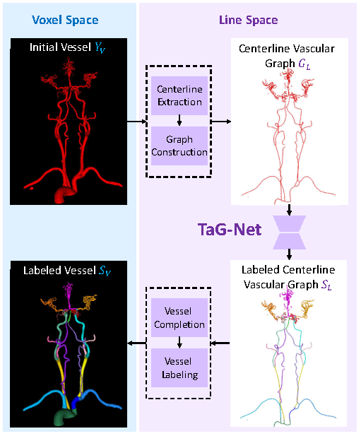
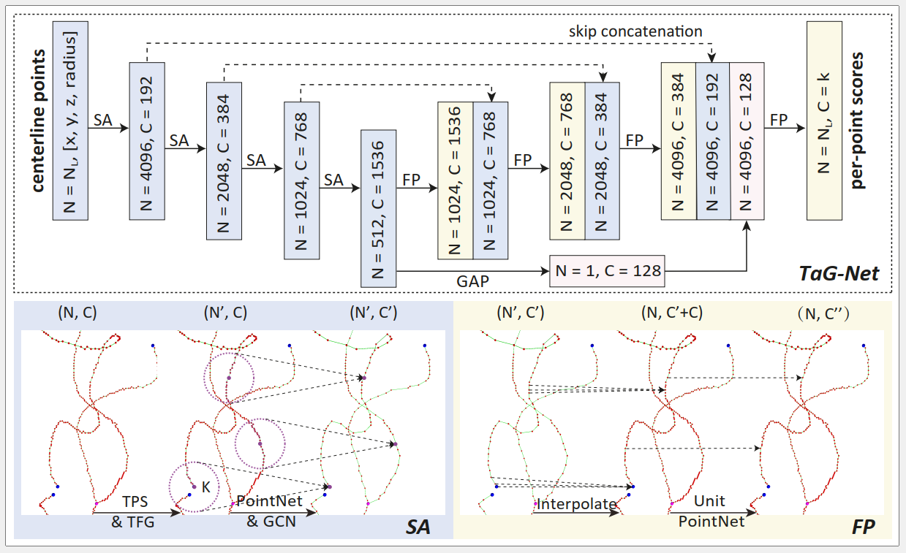
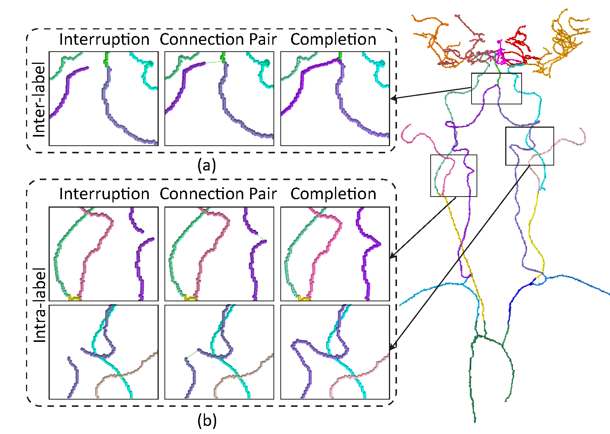
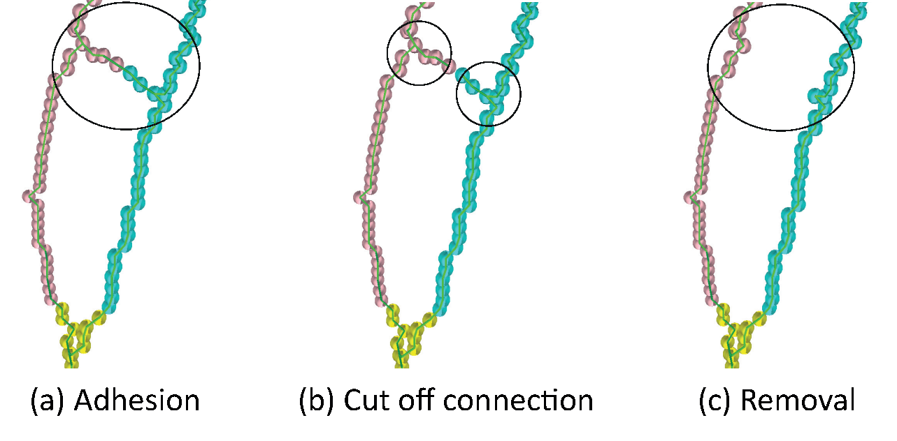

# TaG-Net：Topology-aware Graph Network for Centerline-based Vessel Labeling

This is the official PyTorch implementation for the TaG-Net method to handle the head and neck vessel labeling based on CTA image. 

## Abstract
We propose a novel framework for centerline-based vessel labeling. The framework contains two separate models ([SegNet](SegNet/README.md) and [TaG-Net](TaG-Net/README.md)). [SegNet](SegNet/README.md) is utilized to offer the initial vessel segmentation. [TaG-Net](TaG-Net/README.md) is used for centerline labeling. Besides, a graph-based vessel completion method is proposed and utilized in test stage to alleviate the vessel interruption and adhesion resulted from the initial vessel segmentation. Experimental results show that our proposed method can significantly improve both head and neck vessel segmentation and labeling performance.


## Framework



### SegNet 
[nnU-Net](https://github.com/MIC-DKFZ/nnUNet) (3D U-Net cascade) is trained on our dataset to offer the initial vessel segmentation.

Hu range is set as [0, 800] (Window width/level = 800/400).  

Segmentation models can be downloaded at [Google Drive](https://drive.google.com/drive/folders/1Q1GoRfvVZsSgxbia60jANJscOkKXetyx?usp=sharing)


### TaG-Net



### Vessel Completion


### Adhesion Removal



## Usage: Preparation

### Environment
- Ubuntu 18.04
- Python 3.7 (recommend Anaconda3)
- Pytorch 0.4.1
- CMake >= 3.10.2
- CUDA 9.0 + cuDNN 7.1

### Installation

#### Clone
```bash
git clone https://github.com/PRESENT-Y/TaG-Net.git 
cd TaG-Net
```
#### Pytorch 0.4.1
```bash
conda create -n TaG-Net python=3.7
conda activate TaG-Net
conda install pytorch==0.4.1 torchvision cuda90 -c pytorch
```
#### Other Dependencies (e.g., dgl, networkx, mayavi and dijkstra3d)
```bash
pip install -r requirements.txt 
```
#### Build 
```bash
mkdir build && cd build
cmake .. && make  
```
### Data Preparation

#### Download
- We have provided sample data for testing. 
- Sample data, the corresponding ground truth, and our result can be downloaded at [Google Drive](https://drive.google.com/drive/folders/1Q1GoRfvVZsSgxbia60jANJscOkKXetyx?usp=sharing). 
- Download and put them in `./SampleData`.

#### Centerline Vascular Graph Construction
- Generate centerline from initial segmentation mask.
- Transform centerline image into point set.
- Construct centerline vascular graph from point set.
- Remove isolated nodes and triangles.

```python
python ./GraphConstruction/gen_cl_graph.py
```
For visualization of the centerline graph, you can run the following python files.

```python
python ./GraphConstruction/vis_cl_graph.py
```

## Usage: Training

```python
CUDA_VISIBLE_DEVICES=0 python ./train.py
```
You can modify `./cfgs/config_train.yaml`. 

## Usage: Evaluation
```python
CUDA_VISIBLE_DEVICES=0 python ./test.py
```

## Usage: Vessel Completion
We conduct the [vessel completion](./TaG-Net/VesselCompletion/README.md) based on the labeled vascular graph (output of the TaG-Net).  

```bash
sh ./VesselCompletion/vessel_completion.sh

```
For visualization of the labeled centerline graph, you can run the following python files.

```python
python ./VesselCompletion/vis_labeled_cl_graph.py
```

## License 
The code is released under GPL License (see LICENSE file for details).

## Acknowledgements
- This code repository refers to [nnUNet](https://github.com/MIC-DKFZ/nnUNet), [pointnet.pytorch](https://github.com/fxia22/pointnet.pytorch), [PointNet2_PyTorch](https://github.com/erikwijmans/Pointnet2_PyTorch), and [Relation-Shape-CNN](https://github.com/Yochengliu/Relation-Shape-CNN).

- We use [Mayavi](https://github.com/enthought/mayavi) for point set and centerline vascular graph visualization. 

- We use [EvaluateSegmentation](https://github.com/Visceral-Project/EvaluateSegmentation) for computing metrics.

- We thank all contributors for their awesome and efficient code bases.

## Contact 
If you have some ideas or questions about our research, please contact yaolinlin23@sjtu.edu.cn.